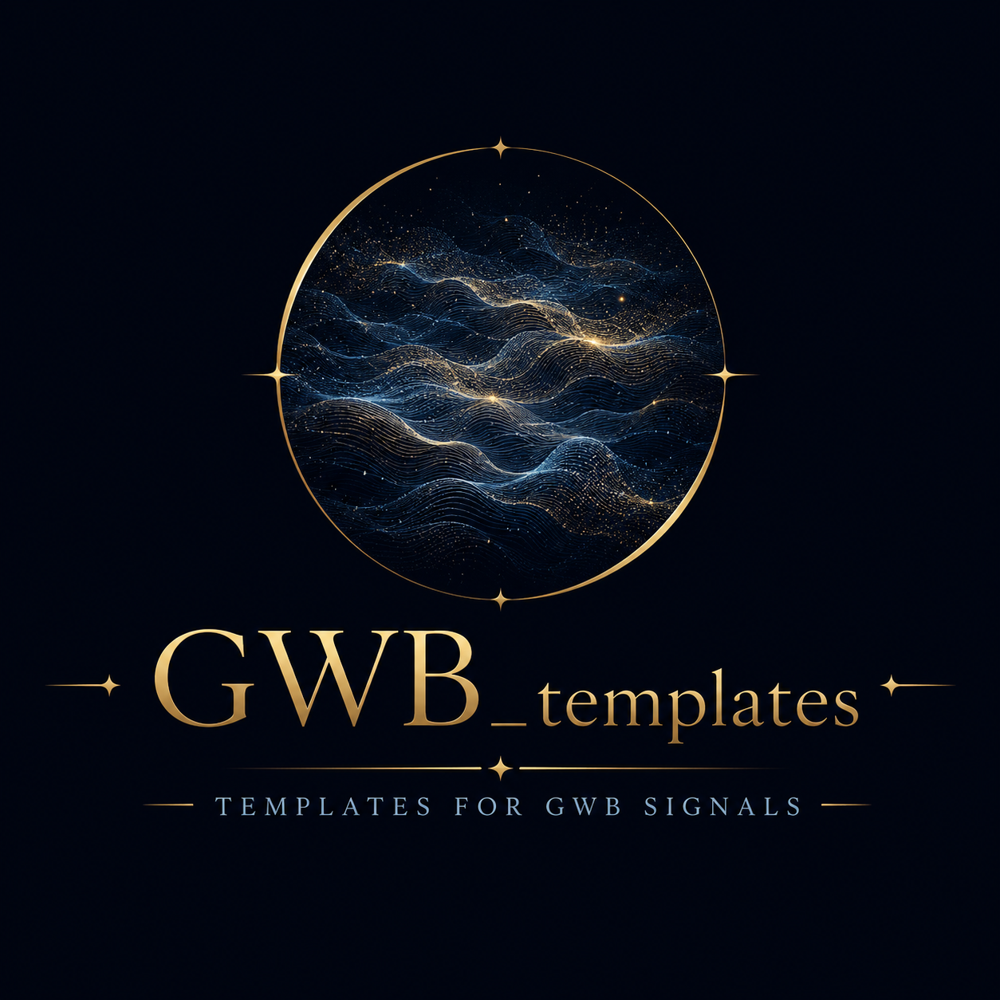

<p align="center">
  
</p>

# GWB_templates

**Gravitational Wave Background signal templates for GWB data analysis.**

`gwb_templates` is a Python library of $h^2\Omega_\mathrm{GW}(f)$ spectral templates, each fully differentiable. Every template is a class inheriting from a small `Template` ABC and exposes a consistent interface for evaluation and parameter / frequency derivatives. Concrete templates are auto-registered on import so any model can be looked up by class name through a single registry.

---

## Features

- **Class-based template hierarchy** — concrete templates inherit from `AnalyticTemplate` (pure-JAX, autodiff) or `NumericalTemplate` (numerical solver under the hood, finite-difference by default, with hooks for custom derivative rules)
- **JAX-friendly** — analytic templates run cleanly under `jax.jit`, `jax.grad`, `jax.vmap`. The hot path is structured as a pure function (`omega_gw_h2_from_parameters`) so callers can wrap it themselves
- **Analytic Jacobians** — most templates ship a hand-rolled `_grad_theta_omega_gw_h2_analytical` override that bypasses autodiff for performance; templates without one transparently fall back to autodiff or finite-differences
- **Auto-discovery registry** — every concrete subclass is registered in `Template._registry` via `__init_subclass__`; lookup by class name via `get_template_from_registry`
- **Double precision** — `jax_enable_x64=True` set globally at import time
- **Precomputed data grids** — interpolation-based templates (cosmic strings, resonant features) load tables in `setup()` and expose JAX-compatible callables

---

## Installation

```bash
pip install .
```

For development (includes linting and testing tools):

```bash
pip install -e ".[dev]"
```

**Dependencies:** `jax>=0.4`, `numpy>=1.21`, `scipy>=1.7`, `interpax>=0.1.0`

---

## Quick Start

```python
import jax.numpy as jnp
import gwb_templates                            # populates the registry on import
from gwb_templates import get_template_from_registry

freq = jnp.geomspace(1e-4, 1e-1, 100)           # Hz

# Look up any template by class name
model = get_template_from_registry("PowerLaw") # or pass kwargs: PowerLaw(pivot=1e-2)

# Evaluate the spectrum from a parameter vector or mapping
theta = jnp.array([-10.0, 2/3])                 # [log_amplitude, tilt]
omega = model.omega_gw_h2_from_parameters(freq, theta)

# Gradient w.r.t. parameters, shape (n_freq, n_params)
grad  = model.grad_theta_omega_gw_h2(freq, theta)

# Hessian w.r.t. parameters, shape (n_freq, n_params, n_params)
hess  = model.hess_theta_omega_gw_h2(freq, theta)

# Frequency derivatives, shape (n_freq,)
df    = model.d_df_omega_gw_h2(freq, theta)
d2f2  = model.d2_df2_omega_gw_h2(freq, theta)

# Mixed derivative, shape (n_freq, n_params)
mixed = model.d2_df_dtheta_omega_gw_h2(freq, theta)
```

### Public attributes & methods on every `Template`

| Member | Description |
| --- | --- |
| `omega_gw_h2(freq, *params, **cfg)` | Direct call with parameters spread positionally. Subclasses implement this. |
| `omega_gw_h2_from_parameters(freq, theta)` | Public entry point; accepts a parameter vector or `{name: value}` mapping. |
| `grad_theta_omega_gw_h2(freq, theta)` | Jacobian w.r.t. parameters. Prefers a class-supplied analytic override, else falls back to the declared backend. |
| `hess_theta_omega_gw_h2(freq, theta)` | Hessian w.r.t. parameters. |
| `d_df_omega_gw_h2`, `d2_df2_omega_gw_h2`, `d2_df_dtheta_omega_gw_h2` | Frequency derivatives and the mixed derivative. |
| `parameter_names` | Tuple of free-parameter names (inferred from `omega_gw_h2` signature). |
| `parameter_labels` | Read-only mapping `{name: LaTeX label}`. |
| `prior_by_param` | Read-only mapping `{name: prior dict}`. |
| `model_type` / `model_name` / `model_label` / `model_id` | Identity strings. |
| `bibtex_entries` | ClassVar tuple of raw BibTeX strings; access joined via `get_bibtex()`. |
| `jittable` / `differentiation_backend` | ClassVars declaring whether `omega_gw_h2` is JIT-safe and which backend the dispatcher uses when no analytic override is present (`"autodiff"` or `"finite_difference"`). |

---

## Writing a new template

```python
from typing import ClassVar
import jax
import jax.numpy as jnp
from gwb_templates.template import AnalyticTemplate

class MyTemplate(AnalyticTemplate):
    r"""$\Omega_{GW} h^2(f) = 10^{A} (f/f_*)^n$."""

    bibtex_entries: ClassVar[tuple[str, ...]] = ()  # TODO: cite

    def __init__(self, pivot: float = 3e-3, **kwargs) -> None:
        self.pivot = float(pivot)
        super().__init__(**kwargs)

    def omega_gw_h2(self, frequency, log_amplitude, tilt) -> jax.Array:
        return 10.0**log_amplitude * (frequency / self.pivot) ** tilt

    # Optional: bypass autodiff with a closed-form Jacobian
    def _grad_theta_omega_gw_h2_analytical(self, frequency, theta) -> jax.Array:
        log_amplitude, tilt = theta
        omega = self.omega_gw_h2(frequency, log_amplitude, tilt)
        return jnp.stack(
            (omega * jnp.log(10.0), omega * jnp.log(frequency / self.pivot)),
            axis=-1,
        )
```

Rules:

- **Free parameters** are the required positional arguments to `omega_gw_h2` after `frequency`. They are inferred from the signature into `parameter_names`.
- **Configuration knobs** (pivot frequencies, cosmology, table filenames, …) are constructor arguments stored on `self`, *not* keyword arguments of `omega_gw_h2`.
- **Numerical templates** (anything loading from disk, building interpolators, or using non-JAX libraries on the hot path) should inherit from `NumericalTemplate` instead. Put heavy setup in `setup()`; it's called once at the end of `__init__`. Override `register_custom_derivatives()` to attach `jax.custom_jvp`/VJP rules if applicable.
- The class auto-registers under its class name on `import` of the module. `get_template_from_registry("MyTemplate")` works.

---

## Template Catalogue

All templates listed below are class names (also their registry keys). The full parameter ordering matches the signature of `omega_gw_h2` for that class.

### Generic

| Class | Parameters | Description |
| --- | --- | --- |
| `Amplitude` | `log_amplitude` | Flat amplitude |
| `PowerLaw` | `log_amplitude, tilt` | Power law |
| `LognormalBump` | `log_amplitude, log_pivot, log_width` | Log-normal bump |
| `BrokenPowerLaw` | `log_amplitude, log_pivot, tilt_1, tilt_2, log_transition` | Broken power law with free smoothness |
| `BrokenPowerLawFixedSmoothness` | `log_amplitude, log_pivot, tilt_1, tilt_2` | Broken power law, fixed smoothness |
| `BrokenPowerLawA1` | `log_amplitude, log_f_b, n_1, n_2, a_1` | Smooth broken power law in `a_1` parametrization |
| `DoubleBrokenPowerLaw` | `log_amplitude, log_f_1, log_f_2, n_1, n_2, n_3, a_1, a_2` | Double broken power law |
| `DoubleBrokenPowerLawRf` | `log_amplitude, log_f_2, log_r_f, n_1, n_2, n_3, a_1, a_2` | Reparametrization of DBPL (ratio of break frequencies) |
| `TwoDoubleBrokenPowerLaws` | 16 params | Sum of two double broken power laws |

### First-order phase transitions

| Class | Parameters | Description |
| --- | --- | --- |
| `FoptBrokenPowerLaw` | `log_amplitude, log_f_star, n_IR, n_UV` | FOPT broken power law |
| `FoptBrokenPowerLawOld` | `log_amplitude, log_pivot` | Legacy 2-param FOPT BPL |
| `PtSoundWaves` | `log_K, log_R_H_star, xi_w, log_T_star` | Sound-wave contribution |
| `PtTurbulence` | `log_Omega_s, log_R_H_star, log_T_star` | Turbulence contribution |
| `PtCollision` | `log_K_tilde, log_beta_over_H, log_T_star` | Bubble-collision contribution |
| `PtPlasma` | `log_K, log_R_H_star, xi_w, log_T_star, epsilon` | Plasma — composes `PtSoundWaves + PtTurbulence` |

### Inflation

| Class | Parameters | Description |
| --- | --- | --- |
| `DoublePeak` | `log_amplitude, log_pivot, beta, k1, k2, rho, gamma` | Double log-normal peak |
| `DoublePeakSharp` | 10 params | `DoublePeak` envelope × sharp-feature modulation |
| `DoublePeakSharpLog` | 10 params | `DoublePeakSharp` with log-parametrized sharp triple |
| `ExcitedStates` | `log_amplitude, log_gamma_ES, log_omega_ES` | Excited initial states |
| `LognormalBumpSharp` | 6 params | `LognormalBump` × sharp-feature modulation |
| `LognormalBumpSharpLog` | 6 params | `LognormalBumpSharp` with log-parametrized sharp triple |
| `SharpFeature` | `A_sharp, omega_sharp_Hz, phase_sharp` | Sharp-feature oscillatory template (arXiv:1407.4034) |
| `SharpFeatureLog` | log-space params | Log-parametrized `SharpFeature` |
| `ResonantFeature` | `A_resonant, omega_resonant, phase_resonant` | Resonant-feature oscillatory template (arXiv:1407.4034). `NumericalTemplate`; loads `data/Resonant_coefficients.npz` |
| `ResonantFeatureLog` | log-space params | Log-parametrized `ResonantFeature` |
| `FlatResonant` | `log_amplitude, A_resonant, omega_resonant, phase_resonant` | Flat amplitude with resonant modulation |
| `FlatResonantLog` | log-space params | Log-parametrized `FlatResonant` |

### Astrophysical foregrounds

| Class | Parameters | Description |
| --- | --- | --- |
| `GalacticBinaries` | `log_amplitude, alpha, log_fr1, log_frk, log_fr2` | Galactic binary confusion noise (Karnesis 2021) |
| `GalacticBinariesA` | `log_amplitude` | Amplitude-only variant; fiducial shape from `galactic_pars(Tobs_yrs, snr, links)` |
| `GalacticBinariesOld` | `log_amplitude, alpha, beta, kappa, gamma, fk` | Legacy galactic-binary template (Mangiagli 2020) |
| `GalacticBinariesOldA` | `log_amplitude` | Amplitude-only legacy variant |
| `ExtragalacticSobbhBns` | `log_amplitude, tilt` | Stellar-origin BBH + BNS foreground |
| `ExtragalacticSobbhBnsA` | `log_amplitude` | Amplitude-only variant |
| `ExtragalacticWd` | `log_amplitude, f_knee, delta, alpha1, alpha2` | Extragalactic WD foreground, single-knee broken PL |
| `ExtragalacticWdA` | `log_amplitude` | Amplitude-only variant |
| `ExtragalacticWd2` | `log_amplitude, f_low, f_high, alpha_low, alpha_high` | Extragalactic WD foreground, double-knee broken PL |
| `ExtragalacticWd2A` | `log_amplitude` | Amplitude-only variant |

### Cosmic strings

All cosmic-string templates inherit from `NumericalTemplate`.

| Class | Parameters | Description |
| --- | --- | --- |
| `CosmicStringModelI` | `log_Gmu, log_alpha, q` | Nambu-Goto Model I (NumPy/SciPy internals; FD backend) |
| `CosmicStringModelIEdf` | `log_Gmu, log_alpha, q, log_T_Extra, Dg_Extra` | Model I with extra DOFs (FD backend) |
| `CosmicStringModelIEos` | `log_Gmu, log_alpha, q, logtemp_GeV, eos` | Model I with equation-of-state correction (FD backend) |
| `CosmicStringModelII` | `log_Gmu` | Model II — precomputed grid `data/Model-II_BOS-loggrid.dat`, JAX-traceable bilinear interpolation (autodiff backend, jittable) |
| `AbelianHiggsModelII` | `log_Gmu, logf` | Abelian-Higgs amplitude-scaled wrapper around Model II |

---

## Project structure

```
src/gwb_templates/
├── __init__.py                       # Imports all template modules → populates Template._registry
├── template.py                       # Template ABC, AnalyticTemplate, NumericalTemplate, get_template_from_registry
├── utils.py                          # Autodiff & finite-difference helpers, interpolator utilities
├── constants.py                      # Cosmological & LISA constants
├── generic_templates/                # PowerLaw, BPL family, lognormal bump, …
├── FOPT_templates/                   # FOPT broken power laws and PT contributions
├── inflation_templates/              # Sharp / resonant / double-peak templates
├── astrophysical_templates/          # Galactic + extragalactic foregrounds
└── cosmic_string_templates/          # Model I / Edf / Eos / II + AbelianHiggs (with data/)
```

---

## Running the tests

```bash
pytest
```

200+ tests covering every template's evaluation, parameter-gradient (analytic vs. autodiff agreement), and stored fixed-value snapshots in `tests/fixed_test_values/reference_templates/`.

---

## License

MIT © Mauro Pieroni
